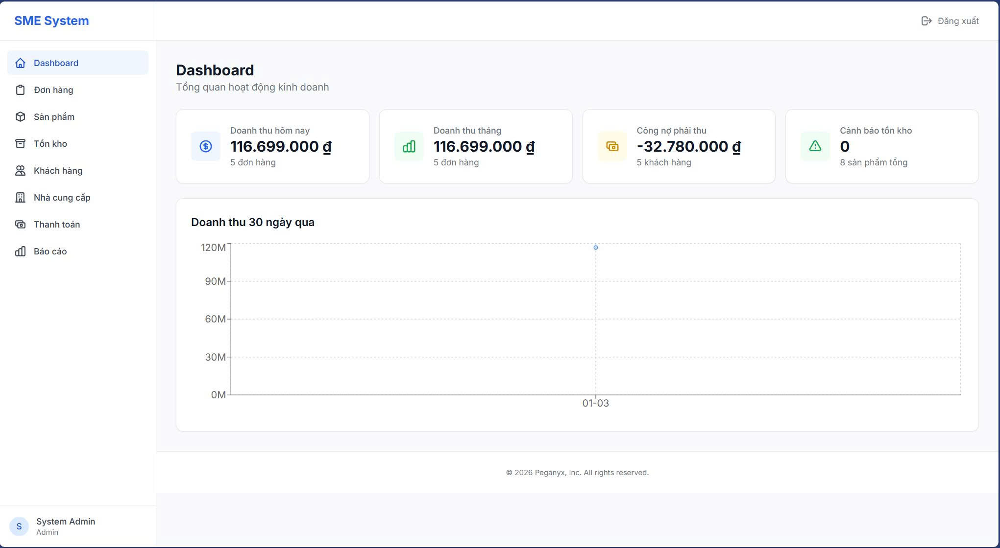
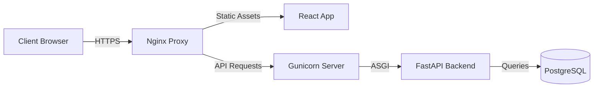

# SME Management System

> **Enterprise-grade operations management platform for modern businesses.**  
> A unified command center to streamline inventory, automate orders, and ensure financial clarity.

---

## 🚀 Product Overview

**SME Management System** is a purpose-built solution for small to medium enterprises facing the chaos of spreadsheet management. It replaces manual tracking with a secure, automated, and audit-ready platform.

**Key Value Propositions:**
*   **Precision**: Zero-error inventory tracking with double-entry stock adjustments.
*   **Speed**: Order processing time reduced by ~70% via automated workflows.
*   **Clarity**: Real-time AR/AP dashboards (Accounts Receivable/Payable).

---

## ⚡ Key Modules

| Module | Capabilities |
|--------|-------------|
| **📦 Smart Inventory** | Multi-warehouse logic, SKU/Barcode management, and Low-stock predictive alerts. |
| **🛒 Order Engine** | State-machine driven workflows (Draft → Confirmed → Shipped) with STRICT validation. |
| **💰 Financial Core** | Integrated AR/AP tracking. Automatic debt calculation per customer/supplier. |
| **🛡️ Enterprise Security** | Role-Based Access Control (RBAC), JWT Rotation, and Immutable Audit Logs. |

---

## 🛠️ Technology Stack

This system is engineered for stability, security, and horizontal scalability.

### Backend Core
*   **Python 3.11 & FastAPI**: High-performance asynchronous API framework.
*   **SQLAlchemy & PostgreSQL 16**: ACID-compliant relational data storage with complex constraint handling.
*   **Pydantic**: Strict data validation and settings management.
*   **Gunicorn**: Production-grade process manager.

### Frontend Experience
*   **React 18**: Component-driven UI architecture.
*   **TanStack Query**: Enterprise-grade server state management and caching.
*   **Tailwind CSS**: Modern utility-first design system.
*   **Nginx**: High-performance reverse proxy and static asset server.

### Infrastructure & DevOps
*   **Docker & Docker Compose**: Containerized micro-architecture for consistent deployment.
*   **Security Hardening**: Environment-variable enforcement, strict CORS policies, and non-root container execution.

---

## 🏗️ System Architecture

The system utilizes a 3-tier architecture designed for security and separation of concerns:

---

## 📜 Licensing & Usage

**This project is a Proprietary Commercial Product.**

*   The source code in this repository is for **Portfolio / Demonstration purposes only**.
*   Unauthorized copying, modification, distribution, or use for commercial purposes is strictly prohibited.
*   For licensing inquiries or to request a live demo, please contact the author.

Copyright © 2026. All Rights Reserved.
