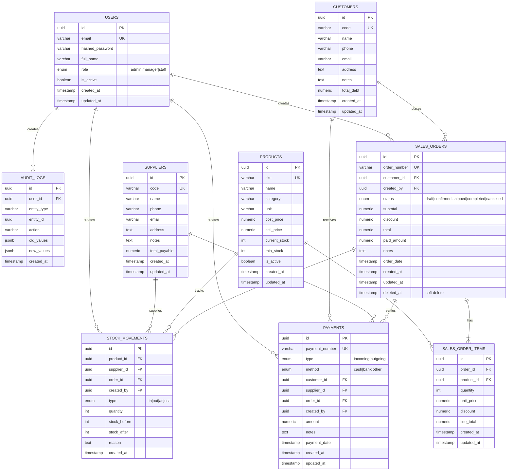

# PostgreSQL Schema - ERD & Migration Plan

## ERD Description



---

## Key Changes from Current Schema

| Aspect | Before | After |
|--------|--------|-------|
| Primary Keys | Integer (auto-increment) | UUID v4 |
| Timestamps | created_at only on some | created_at/updated_at everywhere |
| Soft Delete | None | deleted_at on sales_orders |
| Indexes | Basic | Optimized for common queries |

---

## Index Strategy

### Performance Indexes

```sql
-- Orders: filter by date range, status, customer
CREATE INDEX idx_sales_orders_order_date ON sales_orders(order_date);
CREATE INDEX idx_sales_orders_status ON sales_orders(status);
CREATE INDEX idx_sales_orders_customer_id ON sales_orders(customer_id);
CREATE INDEX idx_sales_orders_deleted_at ON sales_orders(deleted_at) WHERE deleted_at IS NULL;

-- Order Items: lookup by order and product
CREATE INDEX idx_order_items_order_id ON sales_order_items(order_id);
CREATE INDEX idx_order_items_product_id ON sales_order_items(product_id);

-- Products: search and filter
CREATE INDEX idx_products_sku ON products(sku);
CREATE INDEX idx_products_category ON products(category);
CREATE INDEX idx_products_is_active ON products(is_active);

-- Stock Movements: filter by product, type, date
CREATE INDEX idx_stock_movements_product_id ON stock_movements(product_id);
CREATE INDEX idx_stock_movements_created_at ON stock_movements(created_at);

-- Payments: filter by date, type, entities
CREATE INDEX idx_payments_payment_date ON payments(payment_date);
CREATE INDEX idx_payments_type ON payments(type);
CREATE INDEX idx_payments_customer_id ON payments(customer_id);
CREATE INDEX idx_payments_supplier_id ON payments(supplier_id);

-- Audit Logs: filter by entity and date
CREATE INDEX idx_audit_logs_entity ON audit_logs(entity_type, entity_id);
CREATE INDEX idx_audit_logs_created_at ON audit_logs(created_at);
```

---

## Alembic Migration Plan

### Migration: `001_uuid_schema`

1. **Create UUID extension**
   ```sql
   CREATE EXTENSION IF NOT EXISTS "uuid-ossp";
   ```

2. **Drop all existing tables** (fresh start for MVP)

3. **Create new tables with UUID PKs**
   - All PKs use `UUID DEFAULT uuid_generate_v4()`
   - All FKs reference UUID columns
   - Add `created_at`, `updated_at` to all tables
   - Add `deleted_at` to `sales_orders` only

4. **Create indexes** as listed above

5. **Seed initial data** (users, demo data)

---

## SQLAlchemy Model Changes

### Base Mixin for UUID + Timestamps

```python
from sqlalchemy import Column, DateTime
from sqlalchemy.dialects.postgresql import UUID
from sqlalchemy.sql import func
import uuid

class UUIDMixin:
    id = Column(UUID(as_uuid=True), primary_key=True, default=uuid.uuid4)

class TimestampMixin:
    created_at = Column(DateTime(timezone=True), server_default=func.now(), nullable=False)
    updated_at = Column(DateTime(timezone=True), server_default=func.now(), onupdate=func.now(), nullable=False)

class SoftDeleteMixin:
    deleted_at = Column(DateTime(timezone=True), nullable=True)
```

### Models to Update
- `User` - UUID + Timestamps
- `Customer` - UUID + Timestamps
- `Supplier` - UUID + Timestamps
- `Product` - UUID + Timestamps
- `SalesOrder` - UUID + Timestamps + SoftDelete
- `SalesOrderItem` (renamed from OrderLine) - UUID + Timestamps
- `StockMovement` - UUID + created_at only
- `Payment` - UUID + Timestamps
- `AuditLog` - UUID + created_at only
